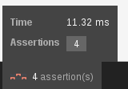
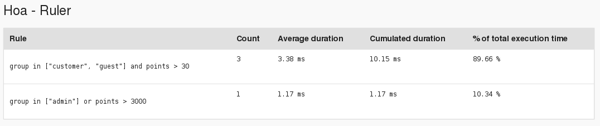

Hoa is a **modular**, **extensible** and **structured** set of PHP libraries.
Moreover, Hoa aims at being a bridge between industrial and research worlds.

# Hoathis\SymfonyRulerBundle

Integrates [`Hoa\Ruler`](https://github.com/hoaproject/Ruler) in Symfony.

## Installation

With [Composer](http://getcomposer.org/), to include this bundle into your
dependencies, you need to require
[`hoathis/symfony-ruler-bundle`](https://packagist.org/packages/hoathis/symfony-ruler-bundle):

```json
{
    "require": {
        "hoathis/symfony-ruler-bundle": "~0.0"
    }
}
```

And add `RulerBundle` to your `AppKernel`:

```php
// app/AppKernel.php

class AppKernel extends Kernel
{
    // …

    public function registerBundles()
    {
        $bundles = array(
            // …
            new Hoathis\SymfonyRulerBundle\HoathisSymfonyRulerBundle(),
        );

        // …
    }
}
```

## Quick usage

### Ruler service

The `RulerBundle` defines a `hoathis.ruler` service that can be used as
described in [`Hoa\Ruler`'s documentation](http://hoa-project.net/Literature/Hack/Ruler.html).

```php
public function indexAction(Request $request)
{
    // 1. Write a rule.
    $ruler = $this->get('hoathis.ruler');
    $rule  = 'group in ["customer", "guest"] and points > 30';

    // 2. Create a context.
    $context           = new \Hoa\Ruler\Context();
    $context['group']  = 'customer';
    $context['points'] = function () {
        return 42;
    };

    // 3. Assert!
    var_dump(
        $ruler->assert($rule, $context) // bool(true)
    );
}
```

### Profiler

When the debug mode is enabled, all assertions are logged and displayed in the
web profiler:




### Configuration reference

```yaml
hoathis_ruler:
    debug:  %kernel.debug%
```

## License

Hoa is under the New BSD License (BSD-3-Clause). Please, see
[`LICENSE`](http://hoa-project.net/LICENSE).
